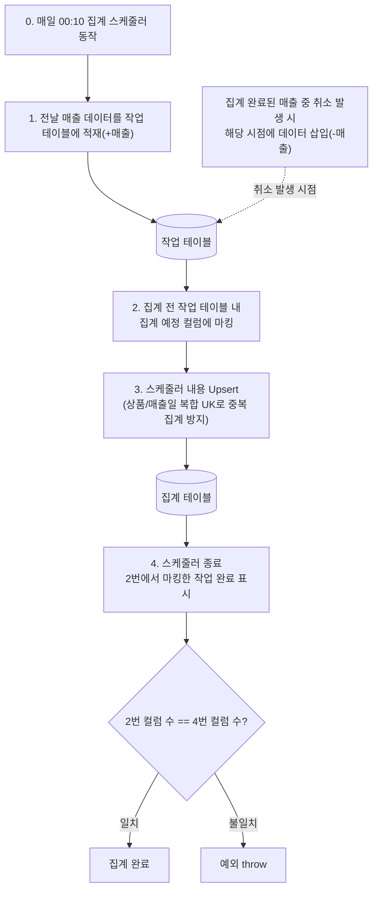

# 과일맛집 - 백엔드

공동구매 예약 서비스 **과일맛집**의 백엔드 레포지토리입니다.
관리자/사용자용 서비스의 서버 기능을 담당하며, Spring Boot 기반 RESTful API 서버로 동작합니다.

---

# 프로젝트 배경 & 문제 정의


- 문제: 카카오톡으로 재고를 관리하고 예약을 받다 보니 피로도가 높고 주문 누락이 종종 발생했습니다.
- 목표(해결하고 싶은 문제): 하나의 공통된 채널(웹) 에서 재고·예약을 일원화해 피로도를 낮추고 누락을 방지합니다.

## 배포 링크

| 환경 | 유저용 | 관리자용                              |
|------|--------|-----------------------------------|
| 운영 | https://fruit-matjip.store | https://fruit-matjip.store/admin      |
| 테스트 | https://dev.fruit-matjip.store | https://dev.fruit-matjip.store/admin |

+ 프론트엔드 레포: [onuljang-fe](https://github.com/SungHoonKim-Ski/onuljang-fe)
+ 배송 추적 Lambda: [delivery-tracker](https://github.com/SungHoonKim-Ski/delivery-tracker) (참고: [shlee322/delivery-tracker](https://github.com/shlee322/delivery-tracker))

---

## 시스템 아키텍처


---

# 매장 예약

오프라인 매장에서 판매하는 과일 상품을 웹으로 예약하고 매장에서 수령하거나 결제 후 배달로 받을 수 있는 시스템입니다.

## 주요 이슈 해결 사례

### 1. 정산 관리 시스템 고도화 및 스케줄러 멱등성 확보

예약 데이터 기반 일일/월간 정산 시스템의 성능 안정성 및 정합성 강화

#### 1-1. 집계 테이블 구축을 통한 DB 조회 병목 해소

**상황**: 서비스 오픈 후 예약 데이터 누적으로 예약 원본 테이블 기반 실시간 집계 조회 시 DB 부하 증가

**해결**: 별도 집계용 테이블을 구축하고 "이벤트 적재 → 스케줄러 실행 → 집계 반영"의 단계별 파이프라인으로 구조 개선. 실시간 계산을 스케줄러 기반 사전 집계 방식으로 전환

**성과**: DB Full Scan 병목 해소, 데이터 증가량에 관계없이 안정적인 응답 속도 유지

#### 1-2. 데이터 모델 레벨의 멱등성 강제를 통한 정산 정합성 보장

**상황**: 스케줄러 재시도/중복 실행 시 동일 예약 건의 중복 합산/차감 위험 및 결제 후 취소 등 사후 이벤트 반영 정책 수립의 어려움

**해결**: 모든 정산 이벤트를 "증가/차감" 단위로 표준화. RDBMS 제약조건과 Upsert를 활용해 동일 입력에 대해 항상 일관된 결과를 보장하도록 멱등성 중심의 데이터 모델 설계

**성과**: 스케줄러 장애 시 수동 보정 작업을 자동화로 대체, 운영 기간 내 정산 불일치 0건(운영 로그 기준)

#### 대안 비교

| 대안 | 검토 결과 |
|------|----------|
| Redis 분산락 기반 단일 실행 보장 | 동시 실행 제어에는 유효하나, 서버 재기동·네트워크 이슈로 인한 재시도 시 중복 반영 문제 해결에 한계 |
| Message Queue 기반 비동기 파이프라인 | 당시 트래픽 규모 대비 인프라 구축·운영 비용 과다 |
| **RDBMS 제약조건 + 데이터 모델 멱등성 (채택)** | 추가 인프라 없이 DB 자체 기능 활용, 장애 상황에서도 데이터 일관성 검증 용이 |

**상세**: [정산 페이지 개선](https://seounghoon.tistory.com/256)

**관련 파일**
[`ReservationAggregationScheduler.java`](./src/main/java/store/onuljang/shop/reservation/scheduler/ReservationAggregationScheduler.java), [`AdminAggregationAppService.java`](./src/main/java/store/onuljang/shop/admin/appservice/AdminAggregationAppService.java), [`ProductDailyAgg.java`](./src/main/java/store/onuljang/shop/product/entity/ProductDailyAgg.java), [`AggApplied.java`](./src/main/java/store/onuljang/shop/product/entity/AggApplied.java), [`ProductDailyAggService.java`](./src/main/java/store/onuljang/shop/product/service/ProductDailyAggService.java)

#### 집계 파이프라인

전일자 매출 건을 집계 테이블에 반영하는 스케줄러. 취소건은 관리자 처리 시점에 별도 적재되며 집계 시 차감.



#### 멱등성 보장 메커니즘

| 단계 | 보장 수단 |
|------|----------|
| 1. 적재 | `INSERT IGNORE` + `UNIQUE(reservation_id, phase)` — 동일 예약의 중복 적재 방지 |
| 2. 작업중 표시 | `batch_uid IS NULL` 조건 — 이미 점유된 행 재점유 방지 |
| 3. Upsert | `ON DUPLICATE KEY UPDATE` — 동일 (sell_date, product_id) 누적 합산 |
| 4. 완료 표시 | claimed/finished 건수 대조 — 불일치 시 예외로 트랜잭션 롤백 |

**관련 파일**
[`ReservationAggregationScheduler.java`](./src/main/java/store/onuljang/shop/reservation/scheduler/ReservationAggregationScheduler.java), [`AdminAggregationAppService.java`](./src/main/java/store/onuljang/shop/admin/appservice/AdminAggregationAppService.java), [`AggApplied.java`](./src/main/java/store/onuljang/shop/product/entity/AggApplied.java), [`ProductDailyAgg.java`](./src/main/java/store/onuljang/shop/product/entity/ProductDailyAgg.java), [`AggAppliedRepository.java`](./src/main/java/store/onuljang/shop/product/repository/AggAppliedRepository.java), [`ProductDailyAggRepository.java`](./src/main/java/store/onuljang/shop/product/repository/ProductDailyAggRepository.java)

### 2. 배달 서비스 PG 결제 연동 및 실시간 알림 시스템 구축

기존 예약 전용 시스템 내 배달 서비스 확장 및 결제 프로세스(PG) 도입

#### 2-1. 트랜잭션 확정 기반 알림 발행으로 데이터 정합성 확보

**상황**: 배달 서비스 도입으로 실시간 결제 처리가 필수화됨에 따라, 결제 완료 전 알림이 발행될 경우 운영자가 미결제 주문을 처리하게 될 위험

**해결**: Spring Event 및 Transaction Lifecycle 관리를 통해 결제 트랜잭션이 확정된 직후에만 알림이 발행되도록 이벤트 전파 순서 제어

**성과**: 결제 도메인 로직과 알림 로직 간의 결합도를 낮추고, 실제 결제 완료 데이터와 운영 알림 간의 정합성 확보

#### 2-2. PG 인프라와 비즈니스 도메인 분리를 통한 유지보수성 강화

**상황**: 배달 주문 정보와 PG사 데이터를 하나의 테이블에서 관리할 경우, 도메인 모델이 외부 인프라에 강하게 의존하게 되어 PG사 변경이나 아키텍처 확장이 어려워지는 문제

**해결**: 주문과 결제 도메인을 물리적 엔티티로 분리. 외부 PG 호출 단계별 상태(준비, 승인, 실패 등)를 독립 테이블에 적재하고 주문 정보를 참조하는 구조로 설계

**성과**: 인프라 의존성을 낮춘 확장성 있는 구조 설계, 결제 이슈 발생 시 운영 로그와 대조 가능한 트랜잭션 추적 데이터 확보

#### 2-3. SSE 기반 실시간 푸시 및 연결 안정성 확보

**상황**: 배달 주문의 즉각적인 처리가 중요해진 반면, 불안정한 모바일 네트워크 환경으로 인한 연결 끊김 및 알림 유실 우려

**해결**: SSE 연결 및 Heartbeat 기법 적용. 클라이언트 재연결 로직과 알림 유실 대비 폴링을 병행하는 하이브리드 전략 구현

**성과**: 도입 후 1달간 총 배달 건수 약 100건에 대해 SSE+Polling 하이브리드 알림으로 안정적 주문 인지 환경 제공

#### 대안 비교

| 대안 | 검토 결과 |
|------|----------|
| WebSocket 양방향 통신 | 실시간성 우수하나 서버 세션 상태 관리 부담, 단순 알림 대비 오버엔지니어링 |
| 주기적 짧은 폴링 | 구현 단순하나 HTTP 요청 부하 증가, 폴링 간격만큼 인지 지연 |
| **SSE 단방향 푸시 (채택)** | 단방향 알림 전송에 최적화, WebSocket 대비 가벼운 리소스로 안정적 운영 |

**상세**: [알림 하나 띄우는데 동시성까지 고민해야 하는 이유](https://seounghoon.tistory.com/272)

**관련 파일**
[`DeliveryAppService.java`](./src/main/java/store/onuljang/shop/delivery/appservice/DeliveryAppService.java), [`DeliveryPaymentProcessor.java`](./src/main/java/store/onuljang/shop/delivery/service/DeliveryPaymentProcessor.java), [`DeliveryPayment.java`](./src/main/java/store/onuljang/shop/delivery/entity/DeliveryPayment.java), [`DeliveryOrder.java`](./src/main/java/store/onuljang/shop/delivery/entity/DeliveryOrder.java), [`AdminDeliverySseService.java`](./src/main/java/store/onuljang/shop/delivery/service/AdminDeliverySseService.java), [`DeliveryPaidEventListener.java`](./src/main/java/store/onuljang/shop/delivery/event/DeliveryPaidEventListener.java)

### 3. 선착순 예약 동시성 제어 최고 140tps

**상황**: 5명 한정 이벤트에 요청 폭주, 동일 재고 row 경쟁으로 중복 예약/재고 음수 위험

**해결**: DB 비관적 락 + 단일 트랜잭션으로 재고 검증–차감–예약 생성을 원자적으로 처리

**성과**: 중복 예약 생성 0건, 재고 음수 0건, 초과 요청은 정상 실패 처리

#### 대안 비교

| 대안 | 검토 결과 |
|------|----------|
| 낙관적 락 (버전 기반) | 충돌 시 재시도 필요, 극단적 경쟁 상황에서 재시도 폭증으로 사실상 활용 불가 |
| Redis 분산락 | 외부 인프라 의존 추가, 단일 DB 구성에서 불필요한 복잡도 |
| **DB 비관적 락 + 단일 트랜잭션 (채택)** | 추가 인프라 없이 RDBMS 자체로 원자성 보장, 단일 서버 구성에 적합 |

**상세**: [선착순 5명 케이크 100원 - 락으로 예약 정합성 지키기](https://seounghoon.tistory.com/267)

**관련 파일**
[`ReservationAppService.java`](./src/main/java/store/onuljang/shop/reservation/appservice/ReservationAppService.java), [`ConcurrentReservationIntegrationTest.java`](./src/test/java/store/onuljang/integration/ConcurrentReservationIntegrationTest.java)

### 4. 운영 이슈 대응 — 재고 불일치 해결

**증상**: 예약/취소 로직에서 락 획득 순서가 일관되지 않아 Deadlock 및 Lock Timeout 발생, 이로 인한 재고 불일치 발생

**조치**: 트랜잭션 내 락 획득 순서를 상품 → 유저 → 예약으로 일원화

#### 대안 비교

| 대안 | 검토 결과 |
|------|----------|
| 애플리케이션 레벨 synchronized | 멀티 인스턴스 환경에서 무효, 확장성 없음 |
| 각 메서드별 개별 락 전략 | 코드 간 락 순서 불일치로 Deadlock 재발 위험 |
| **전역 락 획득 순서 일원화 (채택)** | Deadlock 원천 제거, 코드 일관성 유지, 추가 인프라 불필요 |

**결과**: 재고 정합성 안정화

**관련 파일**
[`ReservationAppService.java`](./src/main/java/store/onuljang/shop/reservation/appservice/ReservationAppService.java), [`ReservationResetScheduler.java`](./src/main/java/store/onuljang/shop/reservation/scheduler/ReservationResetScheduler.java)

---

# 택배 주문

온라인으로 상품을 주문하고 택배로 수령하는 시스템입니다. 카카오페이 결제 연동, 배송 추적 자동화를 포함합니다.

## 주문 상태 전이

```
PAID → ORDERING → ORDER_COMPLETED → IN_TRANSIT → DELIVERED
 (결제완료) (발주중)    (발주완료)       (배송중)     (배송완료)
                                      ↑            ↑
                                  Lambda/스케줄러 활용 자동 업데이트
```

- **PAID → ORDERING**: 관리자가 운송장 엑셀 다운로드 시 자동 전환
- **ORDERING → ORDER_COMPLETED**: 운송장번호 업로드(발주완료) 시 전환
- **ORDER_COMPLETED → IN_TRANSIT → DELIVERED**: SQS 기반 배송 추적으로 자동 전환

## 결제

- 카카오페이 결제 연동
- 미결제 주문 자동 만료 스케줄러
- 결제 상태 점검 스케줄러 (카카오페이 API와 내부 상태 일치 검증)

| 관련 파일 | 역할 |
|-----------|------|
| [`DeliveryPaymentExpireScheduler.java`](./src/main/java/store/onuljang/shop/delivery/scheduler/DeliveryPaymentExpireScheduler.java) | 미결제 주문 만료 |
| [`DeliveryPaymentReconciliationScheduler.java`](./src/main/java/store/onuljang/shop/delivery/scheduler/DeliveryPaymentReconciliationScheduler.java) | 결제 상태 대사 |
| [`DeliveryPaymentService.java`](./src/main/java/store/onuljang/shop/delivery/service/DeliveryPaymentService.java) | 결제 도메인 서비스 |
| [`DeliveryPayment.java`](./src/main/java/store/onuljang/shop/delivery/entity/DeliveryPayment.java) | 결제 엔티티 (주문과 분리) |

## 배송 추적 시스템

SQS + Lambda([delivery-tracker](https://github.com/SungHoonKim-Ski/delivery-tracker)) 기반으로 배송 상태와 위치를 자동 추적하는 비동기 파이프라인입니다.

### 지원 택배사

| 코드 | 택배사 |
|------|--------|
| LOGEN | 로젠택배 |
| HANJIN | 한진택배 |
| CJ | CJ대한통운 |
| LOTTE | 롯데택배 |
| EPOST | 우체국택배 |

### Flow

```
┌──────────────────────────────────────────────────────────────────┐
│                                                                  │
│  ① CourierTrackingRequestScheduler (매시 정각)                     │
│     ORDER_COMPLETED / IN_TRANSIT 상태 주문 조회                     │
│     → 10건 배치로 SQS 요청 큐에 발송                                  │
│     { displayCode, trackingNumber, courierCompany }              │
│                                                                  │
│                         ▼                                        │
│                                                                  │
│  ┌────────────────────────────────────┐                          │
│  │     SQS: 배달 상태 변경 확인 요청 큐     │                          │
│  └─────────────────┬──────────────────┘                          │
│                    ▼                                             │
│                                                                  │
│  ② AWS Lambda (delivery-tracker)                                │
│     SQS 메시지 소비 → 택배사 API 호출                                 │
│     (로젠/한진/CJ대한통운/롯데/우체국)                                  │
│     → 상태가 변경된 배달이 있는 경우 조회 결과를 알림 큐에 전송               │
│                                                                  │
│                    ▼                                             │
│                                                                  │
│  ┌────────────────────────────────────┐                          │
│  │     SQS: 배달 상태 변경 발생 알림 큐     │                          │
│  └─────────────────┬──────────────────┘                          │
│                    ▼                                             │
│                                                                  │
│  ③ TrackingResultPollingScheduler (60초 간격)                     │
│     SQS에서 최대 10건 수신 → 메시지 파싱                                │
│     { displayCode, status, location, timestamp }                 │
│                                                                  │
│     상태 업데이트:                                                  │
│       ORDER_COMPLETED → IN_TRANSIT                               │
│       ORDER_COMPLETED / IN_TRANSIT → DELIVERED                   │
│                                                                  │
│     위치 업데이트:                                                  │
│       trackingLocation, trackingUpdatedAt 갱신                    │
│                                                                  │
│     처리 완료 → SQS 메시지 삭제                                       │
│                                                                  │
└──────────────────────────────────────────────────────────────────┘
```

### 관련 파일

| 파일 | 역할 |
|------|------|
| [`CourierTrackingRequestScheduler.java`](./src/main/java/store/onuljang/courier/scheduler/CourierTrackingRequestScheduler.java) | 배송 추적 요청 발송 (매시 정각) |
| [`TrackingResultPollingScheduler.java`](./src/main/java/store/onuljang/courier/scheduler/TrackingResultPollingScheduler.java) | 추적 결과 수신 및 상태/위치 반영 (60초 간격) |
| [`TrackingResultMessage.java`](./src/main/java/store/onuljang/courier/scheduler/TrackingResultMessage.java) | SQS 결과 메시지 DTO |
| [`SqsConfig.java`](./src/main/java/store/onuljang/shared/config/SqsConfig.java) | AWS SQS 클라이언트 설정 |
| [`CourierOrder.java`](./src/main/java/store/onuljang/courier/entity/CourierOrder.java) | 주문 엔티티 (trackingLocation, trackingUpdatedAt 필드) |

---

# 공통 이슈 해결 사례

### 1. GitHub 태그 기반 배포, SPOF 대비 로그·DB 이중 백업 자동화

- EC2 단일 구성(비용 최적화), swap·dump 옵션 튜닝으로 안정성 확보
- Logback(INFO/WARN 분리) + DB dump를 S3로 1시간 주기 백업, RPO 1시간 달성
- 이후 EC2 내장 DB의 SPOF 위험을 해소하기 위해 Lightsail RDS로 이관 — 자동 스냅샷 기반 백업으로 전환하여 수동 dump 운영 제거
- 운영 중 이슈는 서버 로그 기반으로 모니터링하며 원인 파악 및 대응

**관련 파일**
[`logback-spring.xml`](./src/main/resources/logback-spring.xml), [`LogUploadScheduler.java`](./src/main/java/store/onuljang/shop/admin/scheduler/LogUploadScheduler.java)

### 2. 파일 업로드 메모리 초과

**상황**: 대용량 이미지 업로드 시 서버 메모리 부담 및 타임아웃 발생

**해결**: AWS S3 Presigned URL 방식 도입 — 클라이언트가 직접 S3에 업로드, 다건 업로드 시 프론트엔드에서 병렬 처리

#### 대안 비교

| 대안 | 검토 결과 |
|------|----------|
| 서버 Multipart 직접 업로드 | 대용량 파일 시 서버 메모리 점유, 다건 업로드 시 직렬 처리로 타임아웃 위험 |
| CloudFront 서명 URL | CDN 설정 복잡도 증가, 업로드 전용 용도에 과도한 인프라 |
| **S3 Presigned URL (채택)** | 서버 부하 제로, 클라이언트 병렬 업로드 가능, 구현 단순 |

**관련 파일**
[`AdminUploadService.java`](./src/main/java/store/onuljang/shop/admin/service/AdminUploadService.java), [`AdminUploadController.java`](./src/main/java/store/onuljang/shop/admin/controller/AdminUploadController.java), [`PresignedUrlResponse.java`](./src/main/java/store/onuljang/shop/admin/dto/PresignedUrlResponse.java)

### 3. 과도한 카카오 로그인 API 요청

**상황**: 매 로그인마다 카카오 API를 호출하여 외부 API에 대한 과도한 의존 및 응답 지연 발생

**해결**: Refresh Token을 DB에 저장하고 `/auth/refresh` 엔드포인트로 토큰 갱신, 카카오 API 호출 최소화

#### 대안 비교

| 대안 | 검토 결과 |
|------|----------|
| 매 요청마다 카카오 API 호출 | 외부 API 장애 시 전체 로그인 불가, 응답 지연 누적 |
| 서버 세션 기반 인증 | 수평 확장 시 세션 공유 문제, sticky session 필요 |
| **JWT + DB Refresh Token (채택)** | 카카오 API 호출 최소화, 무상태 확장 가능, 토큰 재사용 감지로 보안 강화 |

**관련 파일**
[`ProdAuthAppServiceImpl.java`](./src/main/java/store/onuljang/shared/auth/appservice/ProdAuthAppServiceImpl.java), [`TokenService.java`](./src/main/java/store/onuljang/shared/auth/service/TokenService.java), [`RefreshToken.java`](./src/main/java/store/onuljang/shared/auth/entity/RefreshToken.java)

## 운영/관리를 위한 주요 기능

| 기능 | 설명 | 관련 파일 |
|------|------|-----------|
| S3에 로그 파일 업로드 | warn 이상 / 모든 level 로그 파일을 매일 s3에 업로드 | [`logback-spring.xml`](./src/main/resources/logback-spring.xml)<br>[`LogUploadScheduler.java`](./src/main/java/store/onuljang/shop/admin/scheduler/LogUploadScheduler.java)|
| 유저/관리자 행위 로깅 | `UserLog`, `AdminLog` 테이블을 통해 주요 행동 기록 | [`UserLogEventListener.java`](./src/main/java/store/onuljang/shared/user/event/UserLogEventListener.java)<br>[`UserReservationLogEventListener.java`](./src/main/java/store/onuljang/shop/product/event/UserReservationLogEventListener.java)<br>[`AdminLogEventListener.java`](./src/main/java/store/onuljang/shop/admin/event/AdminLogEventListener.java)<br>[`AdminProductLogEventListener.java`](./src/main/java/store/onuljang/shop/product/event/AdminProductLogEventListener.java) |
| Refresh Token 관리 | DB에 해시 형태로 저장되고 `replaced_by` 컬럼으로 linked-list 형식 추적 가능 | [`RefreshToken.java`](./src/main/java/store/onuljang/shared/auth/entity/RefreshToken.java)<br>[`TokenService.java`](./src/main/java/store/onuljang/shared/auth/service/TokenService.java) |
| 관리자 권한 검증 강화 | Spring Security 필터, `hasRole`, validate API 추가로 미검증 방지 | [`AdminSecurityConfig.java`](./src/main/java/store/onuljang/shared/auth/security/AdminSecurityConfig.java) |
| 관리자 인증 커스터마이징 | 세션에 관리자 ID 저장 위해 `AdminUserDetails`, `AdminAuthenticationToken` 구현 | [`AdminSecurityConfig.java`](./src/main/java/store/onuljang/shared/auth/security/AdminSecurityConfig.java)<br>[`AdminUserDetails.java`](./src/main/java/store/onuljang/shared/auth/dto/AdminUserDetails.java)<br>[`AdminAuthenticationToken.java`](./src/main/java/store/onuljang/shared/auth/security/AdminAuthenticationToken.java) |
| Brute Force 차단 | 관리자 로그인 5회 실패 시 15분 잠금 (인메모리) | [`LoginAttemptService.java`](./src/main/java/store/onuljang/shared/auth/security/LoginAttemptService.java) |
| CSRF 보호 | 관리자 API에 CSRF 토큰 검증 적용, 프로파일별 쿠키 도메인 분리 | [`AdminSecurityConfig.java`](./src/main/java/store/onuljang/shared/auth/security/AdminSecurityConfig.java) |

## TODO
### 예약 시스템
- [x] **예약 마감 이후 미수령분 일괄취소/재고복원**: 매출/예약 관리 편의성을 위함
- [x] **예약 마감 시간 자동 비활성화**: 일정 시간 이후 당일 판매 상품 예약 마감 처리
- [x] **관리자 판매량 조회 집계 기능 적용**: 판매량 조회 시 예약 테이블 full scan으로 인한 성능 저하 우려
- [x] **로그 데이터 스케줄러 활용 S3 업로드**: 일회성 로그 데이터 관리 필요성
- [x] **cron 활용 DB 백업 S3 업로드**: DB 백업 필요성 - 매일 1시 업로드
- [x] **날짜별 품목 노출 순서 기능**: 제품 수 증가로 노출 품목의 순서 지정 필요성
- [x] **관리자 상품 조회 페이지 개선**: 검색 기능 도입
- [x] **테스트 코드 작성**: 단위 테스트 / 통합 테스트 적용 완료
- [x] **결제 도입**: 카카오페이 연동 완료 / 다른 결제수단 심사중
- [ ] ~~최고 관리자 권한 기능 도입: 다른 관리자의 권한 생성/수정/삭제 가능하도록 확장~~ 보류
- [x] **상품 카테고리화**: 제품량 증가로 인해 사용자에게 보일 품목의 순서 지정 필요성
### 택배 시스템
- [ ] 멀티 소스 결제 수단 지원
- [ ] 택배 상태 변경 시 push 알림
- [ ] 택배 매출 정산 기능 구현

---

## 코드 계층 구조

해당 백엔드 프로젝트는 **도메인 계층 구분을 적용한 구조**로 설계했습니다.

```text
Controller
   ↓
AppService (use-case 단위)
   ↓
Service (세부 도메인 로직)
   ↓
Repository (JPA 기반 DB 접근)
```

| 계층        | 설명 |
|-------------|------|
| `Controller` | HTTP 요청 처리 및 응답 반환. 인증된 유저 정보를 받아 appService로 전달 |
| `AppService` | use-case 단위로 묶인 주요 기능 단위. 트랜잭션 단위로 처리됨 |
| `Service`    | 실제 비즈니스 도메인 중심의 내부 로직 담당 |
| `Repository` | JPA 기반 DB 접근 계층 (쿼리 메서드, fetch join 등 포함) |

---

## 배포 전략

- GitHub Actions를 활용해 테스트/상용 환경 CI/CD 자동화
- **태그 푸시 시점에만 배포 수행**

```yaml
on:
  push:
    tags:
      - "[0-9]+\.[0-9]+\.[0-9]+-[dp]\.[0-9]+"
```

- 배포 분기 로직은 GitHub Actions 스크립트 내부에서 `-d`(dev), `-p`(prod) 접미어로 판단

### 주요 테스트 파일

42개 테스트 파일, 330개 테스트 메서드

| 테스트 파일 | 설명 | 테스트 수 |
|------------|------|----------|
| [`AdminProductIntegrationTest`](./src/test/java/store/onuljang/integration/AdminProductIntegrationTest.java) | 관리자 상품 관리 API (CRUD/카테고리/이미지/순서) | 22개 |
| [`ReservationIntegrationTest`](./src/test/java/store/onuljang/integration/ReservationIntegrationTest.java) | 사용자 예약 API (생성/취소/수량변경/셀프픽업) | 14개 |
| [`ProductsIntegrationTest`](./src/test/java/store/onuljang/integration/ProductsIntegrationTest.java) | 사용자 상품 조회 API | 11개 |
| [`AdminCustomerFilterIntegrationTest`](./src/test/java/store/onuljang/integration/AdminCustomerFilterIntegrationTest.java) | 고객 관리 필터/정렬 API | 9개 |
| [`UserIntegrationTest`](./src/test/java/store/onuljang/integration/UserIntegrationTest.java) | 사용자 정보 관리 API | 9개 |
| [`UserRestrictionIntegrationTest`](./src/test/java/store/onuljang/integration/UserRestrictionIntegrationTest.java) | 이용제한/경고 API | 9개 |
| [`AdminReservationIntegrationTest`](./src/test/java/store/onuljang/integration/AdminReservationIntegrationTest.java) | 관리자 예약 관리 API | 7개 |
| [`ProductCategoryIntegrationTest`](./src/test/java/store/onuljang/integration/ProductCategoryIntegrationTest.java) | 상품 카테고리 API | 7개 |
| [`DeliveryReservationStatusIntegrationTest`](./src/test/java/store/onuljang/integration/DeliveryReservationStatusIntegrationTest.java) | 배달 예약 상태 관리 | 5개 |
| [`ConcurrentReservationIntegrationTest`](./src/test/java/store/onuljang/integration/ConcurrentReservationIntegrationTest.java) | 동시성 예약 시나리오 | 4개 |
| [`AdminAggregationIntegrationTest`](./src/test/java/store/onuljang/integration/AdminAggregationIntegrationTest.java) | 관리자 판매 집계 조회 API | 4개 |
| [`AdminLoginBruteForceIntegrationTest`](./src/test/java/store/onuljang/integration/AdminLoginBruteForceIntegrationTest.java) | 로그인 Brute Force 차단 | 4개 |
| [`AdminControllerIntegrationTest`](./src/test/java/store/onuljang/integration/AdminControllerIntegrationTest.java) | 관리자 인증/권한 API | 4개 |
| [`ReservationResetSchedulerTest`](./src/test/java/store/onuljang/scheduler/ReservationResetSchedulerTest.java) | 예약 초기화 스케줄러 | 3개 |
| [`DeliveryPaymentReconciliationSchedulerTest`](./src/test/java/store/onuljang/scheduler/DeliveryPaymentReconciliationSchedulerTest.java) | 카카오페이 결제 대사 스케줄러 | 5개 |
| [`DeliveryPaymentExpireSchedulerTest`](./src/test/java/store/onuljang/scheduler/DeliveryPaymentExpireSchedulerTest.java) | 미결제 주문 만료 스케줄러 | 4개 |
| [`ReservationAggregationSchedulerTest`](./src/test/java/store/onuljang/scheduler/ReservationAggregationSchedulerTest.java) | 예약 집계 스케줄러 | 4개 |

### CI/CD 통합

- **자동 테스트 실행**: PR 및 main/develop 브랜치 push 시 자동 실행
- **배포 전 검증**: 태그 기반 배포 시 테스트 통과 필수
- **테스트 리포트**: GitHub Actions에서 테스트 결과 및 리포트 자동 생성

```bash
# 로컬에서 전체 테스트 실행
./gradlew test

# 특정 테스트만 실행
./gradlew test --tests AdminReservationIntegrationTest
```

---

## 기술 스택

- Java 17 / Spring Boot 3.4
- Spring Security + JWT
- Spring Data JPA + QueryDSL (MySQL, Lightsail RDS)
- Kakao OAuth 로그인
- KakaoPay 결제 연동
- AWS S3 + Presigned-url 기반 이미지 업로드
- AWS SQS + Lambda 기반 배송 추적 파이프라인
- Spring Session JDBC 기반 세션 관리
- OpenFeign (카카오 API 연동)

---

## 인증/인가 아키텍처

| 구분 | 인증 방식 | 상세 설명 |
|------|-----------|-----------|
| 사용자 | JWT + Kakao OAuth | Kakao 로그인 후 JWT (Access / Refresh) 발급 및 쿠키 저장 |
| 관리자 | Spring Session 기반 | JDBC 세션 저장소 사용, `ADMINSESSION` 쿠키 기반 로그인 유지 |

- 사용자는 `카카오 OAuth → 자체 JWT 발급 → 쿠키 저장` 방식
- 관리자는 세션 쿠키를 통한 상태 기반 인증 유지
- Refresh Token 재사용 감지 시 해당 사용자의 전체 토큰 일괄 revoke
- 관리자 로그인 Brute Force 차단 (5회 실패 → 15분 잠금)
- 관리자 API CSRF 보호 (CookieCsrfTokenRepository, 프로파일별 쿠키 도메인 분리)
- 보안 헤더 적용 (X-Frame-Options, HSTS, CSP, X-Content-Type-Options)
